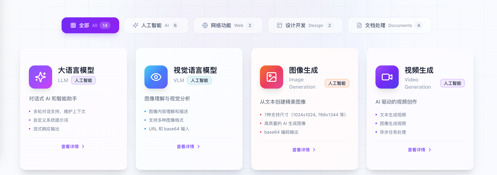
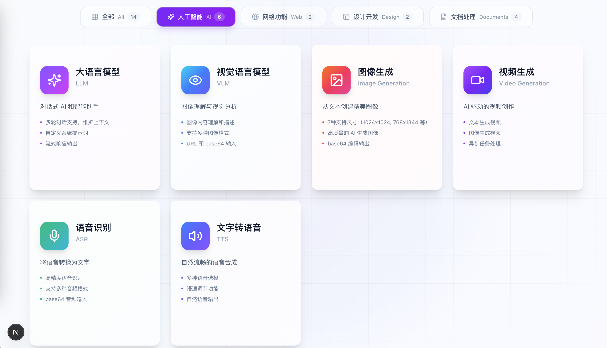
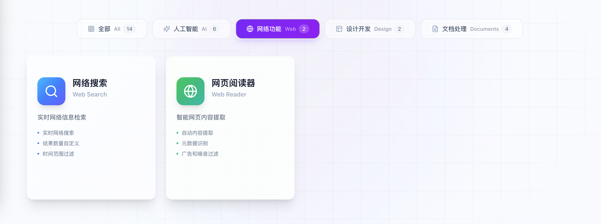
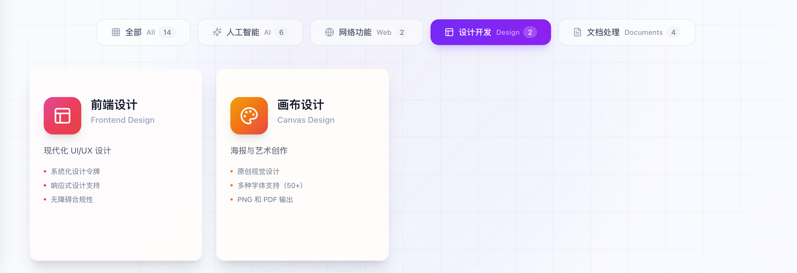
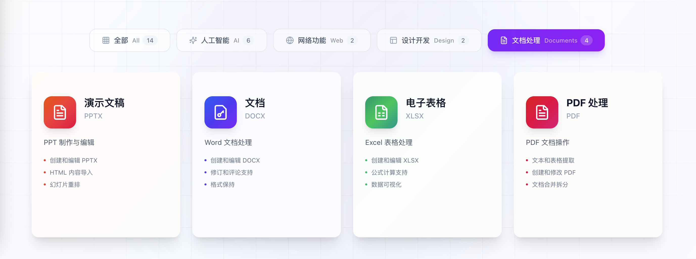

# Z.ai Skills 技能集合

智普GLM4.7 Skills工具包。包含完整文档、实现代码和使用示例。




## 概览

| 指标 | 数量 |
|------|------|
| 技能总数 | 14 |
| 代码示例 | 50+ |
| 使用场景 | 100+ |
| 文档页面 | 200+ |

## 技能包包含内容

- 14 个技能的完整 SKILL.md 文档
- TypeScript/Python 实现脚本和工具代码
- MIT 许可证文件和配置说明
- 详细的 README.md 说明文档
- 丰富的使用示例和最佳实践
- 设计模板和样式系统（Canvas Design）
- OOXML 规范文件（DOCX/PPTX）
- 50+ 种设计字体（Canvas Design）

## 技能分类

### 大语言模型



#### LLM - 对话式 AI 和智能助手
- 多轮对话支持，维护上下文
- 自定义系统提示词
- 流式响应输出

### 视觉语言模型

#### VLM - 图像理解与视觉分析
- 图像内容理解和描述
- 支持多种图像格式
- URL 和 base64 输入

### 图像生成

#### Image Generation - 从文本创建精美图像
- 7种支持尺寸（1024x1024, 768x1344 等）
- 高质量的 AI 生成图像
- base64 编码输出

### 视频生成

#### Video Generation - AI 驱动的视频创作
- 文本生成视频
- 图像生成视频
- 异步任务处理

### 语音识别

#### ASR - 将语音转换为文字
- 高精度语音识别
- 支持多种音频格式
- base64 音频输入

### 文字转语音

#### TTS - 自然流畅的语音合成
- 多种语音选择
- 语速调节功能
- 自然语音输出

### 网络功能



#### Web Search - 实时网络信息检索
- 实时网络搜索
- 结果数量自定义
- 时间范围过滤

#### Web Reader - 智能网页内容提取
- 自动内容提取
- 元数据识别
- 广告和噪音过滤

### 设计开发



#### Frontend Design - 现代化 UI/UX 设计
- 系统化设计令牌
- 响应式设计支持
- 无障碍合规性

#### Canvas Design - 海报与艺术创作
- 原创视觉设计
- 多种字体支持（50+）
- PNG 和 PDF 输出

### 文档处理



#### PPTX - PPT 制作与编辑
- 创建和编辑 PPTX
- HTML 内容导入
- 幻灯片重排

#### DOCX - Word 文档处理
- 创建和编辑 DOCX
- 修订和评论支持
- 格式保持

#### XLSX - Excel 表格处理
- 创建和编辑 XLSX
- 公式计算支持
- 数据可视化

#### PDF - PDF 文档操作
- 文本和表格提取
- 创建和修改 PDF
- 文档合并拆分


## 快速开始


```bash
# 克隆仓库
git clone https://github.com/156554395/z-ai-skills

# 进入目录
cd z-ai-skills

# 安装依赖（如需要）
bun install

# 运行
bun run dev
```

## 技能目录结构

```
skills/
├── llm/              # 大语言模型
├── vlm/              # 视觉语言模型
├── image-generation/  # 图像生成
├── video-generation/  # 视频生成
├── asr/              # 语音识别
├── tts/              # 文字转语音
├── web-search/       # 网络搜索
├── web-reader/       # 网页阅读器
├── frontend-design/  # 前端设计
├── canvas-design/    # 画布设计
├── pptx/             # PPT 处理
├── docx/             # Word 处理
├── xlsx/             # Excel 处理
└── pdf/              # PDF 处理
```

## 许可证

MIT License - 详见 [LICENSE](LICENSE) 文件

---

Built with [Z.ai](https://chat.z.ai) - AI 驱动的开发平台(本程序只供研究学习使用)
